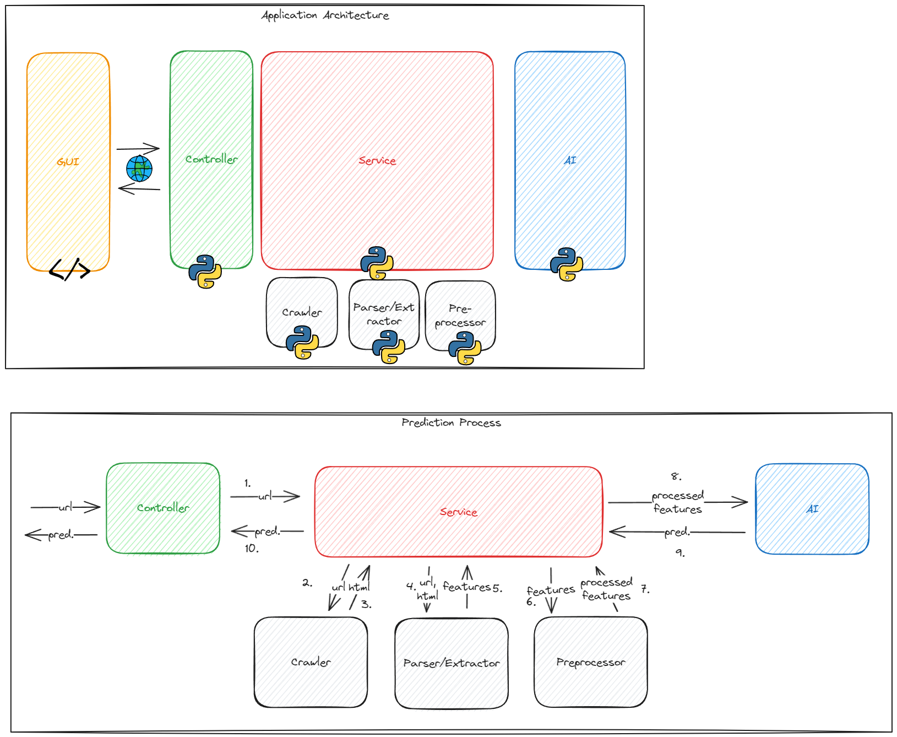

#AISA #AI 
# Architecture

# Project Management
## Phases:
1. Data Understanding & Experimentation
-> Understand data (limitations, independence, balance) and know what models to use
2. Data Preparation, Model creation & Model Evaluation
-> Trained Models, ready to use
3. Implementation of backend application
-> Rest-API that provides prediction functionality
4. Implementation of graphical interface
-> GUI that can be used via the browser

